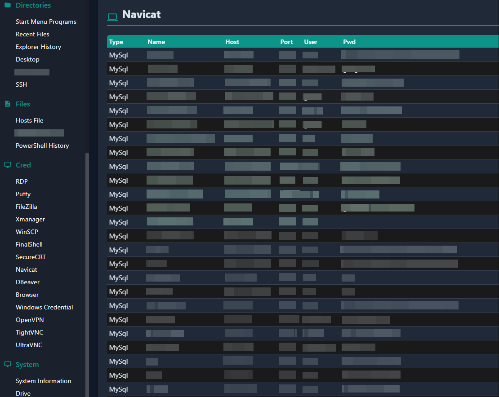

# WinDump

后渗透信息/密码/凭证收集工具

相对于其他工具主要有以下特点

1. 报告使用html更直观
2. 增加ssh的key相关的获取
3. 不使用危险的操作
	1. 不使用额外命令
	2. 不使用远程注入/读写内存
4. 使用.Net Framework v2.0兼容更多系统

## 收集列表

| **名称**              | **描述**                      | **备注**                     | **等价命令**                             |
|---------------------|-----------------------------|----------------------------|--------------------------------------|
| Interface           | 网卡信息                        |                            | ipconfig                             |
| Route               | 路由信息                        |                            | route print                          |
| TCP                 | tcp连接信息                     |                            | netstat -ano -p tcp                  |
| UDP                 | udp连接信息                     |                            | netstat -ano -p udp                  |
| DNSCache            | dns缓存                       | win8/server2012以上支持        | ipconfig /displaydns                 |
| WIFI                | wifi信息                      | 包含密码                       | netsh wlan export profile  key=clear |
| User                | 用户列表                        |                            |                                      |
| LoggedUser          | 已登录用户                       |                            | quser                                |
| Process             | 进程信息                        |                            | tasklist                             |
| Service             | 服务信息                        |                            | sc queryex type= service state= all  |
| AV                  | 杀软                          |                            |                                      |
| Start Menu Programs | 开始菜单目录                      |                            |                                      |
| Recent Files        | 最近文件目录                      |                            |                                      |
| Explorer History    | 文件管理器历史                     | 包含Win+R历史、文件管理器中输出历史       |                                      |
| Desktop             | 桌面目录                        |                            |                                      |
| Documents           | 文档目录                        |                            |                                      |
| SSH                 | ~\.ssh目录                    | 包含config文件中指向的IdentityFile |                                      |
| Hosts File          | hosts文件                     |                            |                                      |
| IIS Configuration   | IIS配置文件                     |                            |                                      |
| RDP                 | RDP连接历史                     | 不包含密码                      |                                      |
| Putty               | Putty连接历史                   | 不包含密码                      |                                      |
| FileZilla           | FileZilla站点和快速连接            | 包含密码和key                   |                                      |
| Xmanager            | XShell/XFTP/XStart/Xmanager | 包含密码和key                   |                                      |
| WinSCP              | WinSCP站点                    | 包含密码和key                   |                                      |
| FinalShell          | FinalShell                  | 包含密码和key                   |                                      |
| SecureCRT           | SecureCRT                   | 包含密码和key                   |                                      |
| Navicat             | Navicat                     | 包含密码和ssh隧道的密码和key          |                                      |
| DBeaver             | DBeaver                     | 包含密码和ssh隧道的密码              |                                      |
| Browser             | 基于chrome的浏览器                | 只包含密码，不支持v20               |                                      |
| Windows Credential  | windows凭据                   | 包含RDP/OpenVPN等的密码          |                                      |
| OpenVPN             | OpenVPN的连接配置文件              | 包含ovpn文件                   |                                      |
| TightVNC            | TightVNC服务端密码               |                            |                                      |
| UltraVNC            | TightVNC服务端密码               |                            |                                      |
| System Information  | 系统版本/内存/代理/补丁等              |                            |                                      |
| Drive               | 驱动器                         |                            |                                      |
| Product             | 安装软件                        |                            |                                      |

## 截图

## 相关链接

重度参考了以下项目

* <https://github.com/qwqdanchun/Pillager>
* <https://github.com/eeeeeeeeee-code/e0e1-config>
* <https://github.com/Aabyss-Team/Antivirus-Scan/>